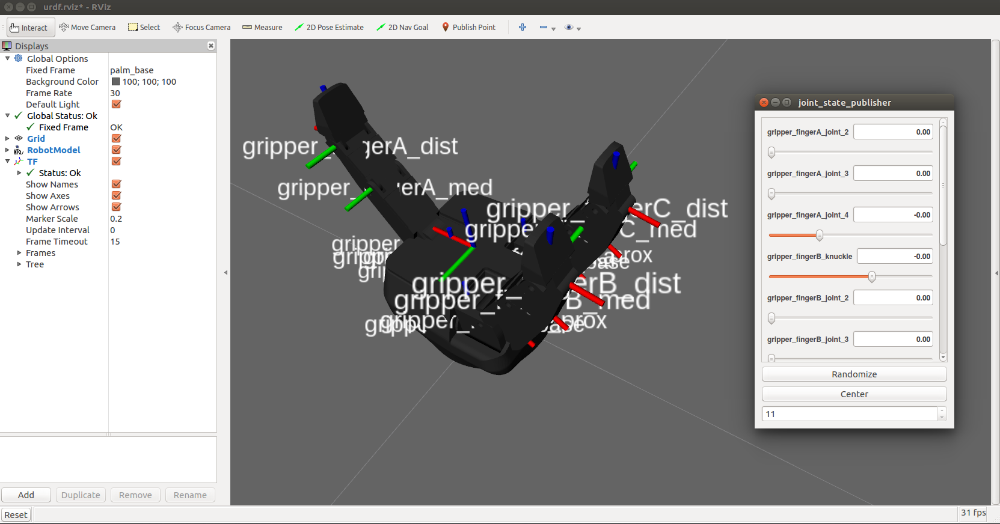

robotiq_3finger_description
===========================

ROS package providing a URDF model of the Robotiq 3-Finger Gripper.

View the gripper in `RViz` by running

    roslaunch robotiq_3finger_description display.launch gui:=true

